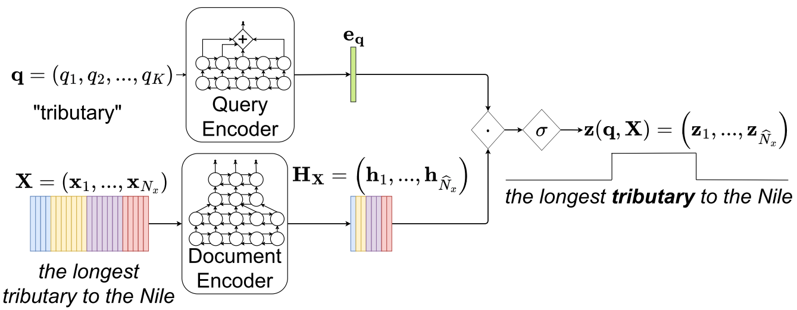

# Description

This repository implements dual-encoder end-to-end open vocabulary keyword search method described in:

- [Yusuf, B., Gok, A., Gundogdu, B., Saraclar, M. (2021) "End-to-End Open Vocabulary Keyword Search". Proc. Interspeech 2021, 4388-4392, doi: 10.21437/Interspeech.2021-1399]. [ISCA link.](https://www.isca-archive.org/interspeech_2021/yusuf21_interspeech.html) [VUT link,](https://www.fit.vut.cz/research/publication/12612/.en) [Arxiv link.](https://arxiv.org/abs/2108.10357)

- [B. Yusuf, J. Černocký and M. Saraçlar, "End-to-End Open Vocabulary Keyword Search With Multilingual Neural Representations," in IEEE/ACM Transactions on Audio, Speech, and Language Processing, vol. 31, pp. 3070-3080, 2023, doi: 10.1109/TASLP.2023.3301239.] [IEEE link,](https://ieeexplore.ieee.org/document/10201906) [VUT link,](https://www.fit.vut.cz/research/publication/13057/.en) [Arxiv link.](https://arxiv.org/abs/2308.08027)

The model has:
- A query encoder which takes a written query in the form of a sequence and returns
a vector encoding of the query
- A document encoder which takes a spoken document in the form of a sequence of
acoustic features and returns a down-sampled encoding of the document

The model then outputs the sequence of inner-products between the query encoding and
each frame of the document encoding. The model is trained so that the sigmoid of each
output at some frame corresponds to the probability of the query occurring at that frame.

Doing this across utterances in a spoken archive is used to return the locations of
in the spoken archive.



# Requires
* numpy
* pandas
* pytorch
* torchaudio
* transformers

# Libri-light 10h recipe
## Download and extract features (xls-r by default)
```
bash golden_retriever/libri_light/prep_libri_data.sh golden_retriever/libri_light/datadir
# bash golden_retriever/libri_light/prep_libri_data.sh golden_retriever/libri_light/datadir mel # for mel spectrograms
```
## Training
### Default E2E KWS with paired training 
```
python -u golden-retriever/train_kws.py \
    --trainer-json golden-retriever/conf/trainer.json \
    --qmj golden-retriever/conf/query_encoder.json \
    --dmj golden-retriever/conf/document_encoder.json \
    --qs \
    --frame-length 0.02 \  # XLS-R has frame length ~0.02s. For MelSpectrogram, this should be changed to 0.01
    golden-retriever/libri_light/train_10h.rttm \
    golden-retriever/libri_light/datadir/feats/xlsr/librispeech_finetuning/ \
    golden-retriever/models/e2e_kws_model
```

### JOSTER training
Alternative joint speech text retriever (JOSTER) training.
This allows joint training with unpaired text to be published in our upcoming TASLP paper.
The main idea is to learn to integrate unpaired text (similar to a language model in ASR) by jointly learning to search for text-in-text in addition to text-in-speech search.
```
python -u golden-retriever/train_multitask.py \
    --trainer-json golden-retriever/conf/trainer.json \
    --qmj golden-retriever/conf/query_encoder.json \
    --dmj golden-retriever/conf/multitask_document_encoder.json \
    --qs \
    --frame-length 0.02 \
    golden-retriever/libri_light/train_clean_100.tsv \
    golden-retriever/libri_light/train_10h.rttm \
    golden-retriever/libri_light/datadir/feats/xlsr/librispeech_finetuning/ \
    golden-retriever/models/joster_model
```

## Indexing
```
# Create document vector index
python -u golden-retriever/make_linear_vector_index.py \
    golden-retriever/libri_light/datadir/feats/xlsr/dev-clean/ \ # or another dataset
    golden-retriever/models/e2e_kws_model/best \
    golden-retriever/indexes/e2e_kws_model_dev-clean

```

## Search
```
# Search list of keywords in index
python golden-retriever/search_linear_index.py \
    --no-cuda \
    golden-retriever/libri_light/dev_clean_keywords.txt \
    golden-retriever/indexes/e2e_kws_model_dev-clean \
    golden-retriever/models/e2e_kws_model/tokenizer.pkl \
    golden-retriever/models/e2e_kws_model/best/ \
    golden-retriever/search_outputs/dev_clean/
```


## Scoring
We use [NIST's F4DE](https://github.com/usnistgov/F4DE) scoring tool for scoring in the papers and we recommend that the user do the same.

We however provide a scoring script for quick TWV computation.
Note that due to different alignment method, the results will not be identical to the F4DE output.
```
python -u golden-retriever/compute_twv.py \
    --kst-alpha 12 \ # Optional variable for score normalization. Should be tuned on a dev set
    --atwv-threshold 0.48 \ # Scoring threshold. Should also be tuned no a dev set
    golden-retriever/libri_light/dev_clean_keywords.txt \
    15126 \ # Duration. Required for computing pFA
    golden-retriever/libri_light/dev_clean.rttm \  # Reference
    golden-retriever/search_outputs/dev_clean/results/ \
    golden-retriever/search_outputs/dev_clean/scores ) # Scoring directory
```
